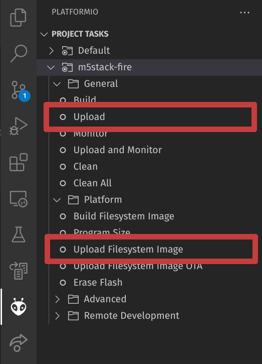

# M5Paper Room Booking

## Setup

### Environment
Requirements:
- [Python 3](https://www.python.org/downloads/)
- [Node.js 16](https://nodejs.org/en/download/)
- [VSCode extension: PlatformIO IDE](https://platformio.org/platformio-ide) (PlatformIO CLI can also work, but isn't really simpler)

Run commands below to set up the project
```sh
# Install python requirements
pip install -r ./scripts/requirements.txt

# Setup littlefs and build frontend
python ./scripts/setup.py littlefs frontend
```

### Other
- Google Cloud Platform
  - Project needs to be created
  - Calendar API needs to be enabled in the project
  - OAuth client ID credentials need to be created and exported to file "credentials.json"
- Organization
  - Needs to create an user to handle the booking e.g. booking@monad.fi
- Calendar
  - A room and an automatic calendar for the room needs to be created
  - The room calendar needs to be shared with edit access with our user
  - Id of the room calendar is needed for code operation, it can be retrieved from the settings of the calendar

## Deployment

### Generate token
Authorize the program by logging in with the user (the following command pops up a web page where you can log in):
```sh
python ./scripts/oauth2flow.py
```
This generates a token.json that is used by the program to access and edit the calendars. Put it into a safe place because the same token should be used for all devices. Specifically, 25 is the maximum number of simultaneously working tokens, so generating more carelessly will create problems.

### Build and upload
Navigate to the VSCode PlatformIO extension tab and click the buttons below.


These commands build and upload the program and the filesystem.

### Device setup
The device needs to be restarted by pressing the reset button in the back and then holding the side button down for a few seconds.

The device will boot into setup mode, where it opens a web server in order to receive configurations.

Connect to the WIFI corresponding to the SSID shown on the device. Navigate to the shown IP address in your browser and fill in the configuration options shown on the page. There you will need the token.json file that was generated earlier.

Restart the device again by pressing the reset button in the back and then holding the side button down for a few seconds.

Now configuration is done and the device is ready to use.

